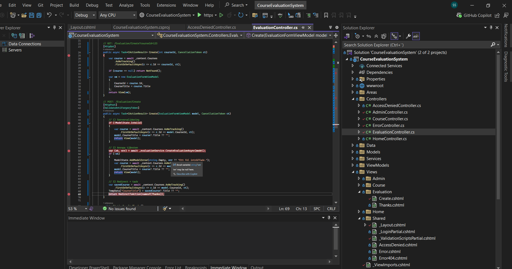
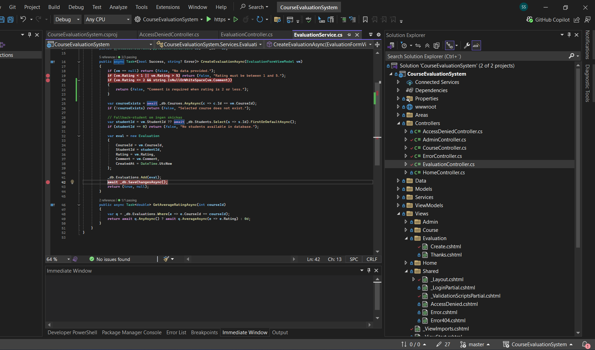
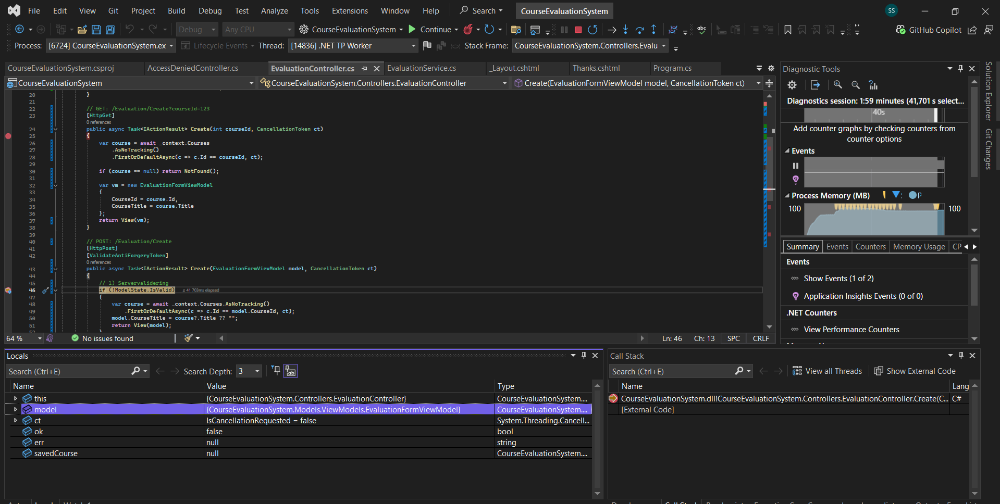
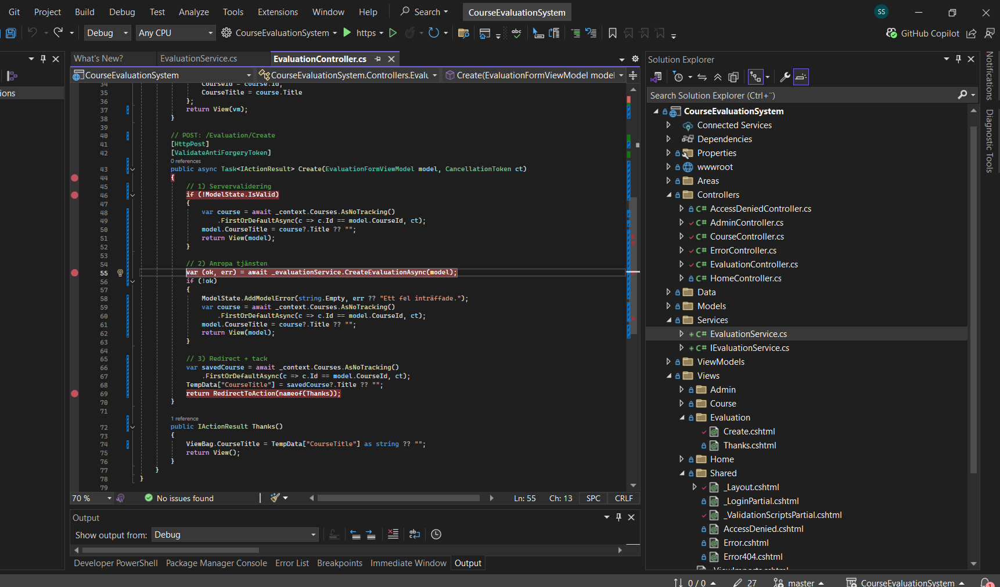
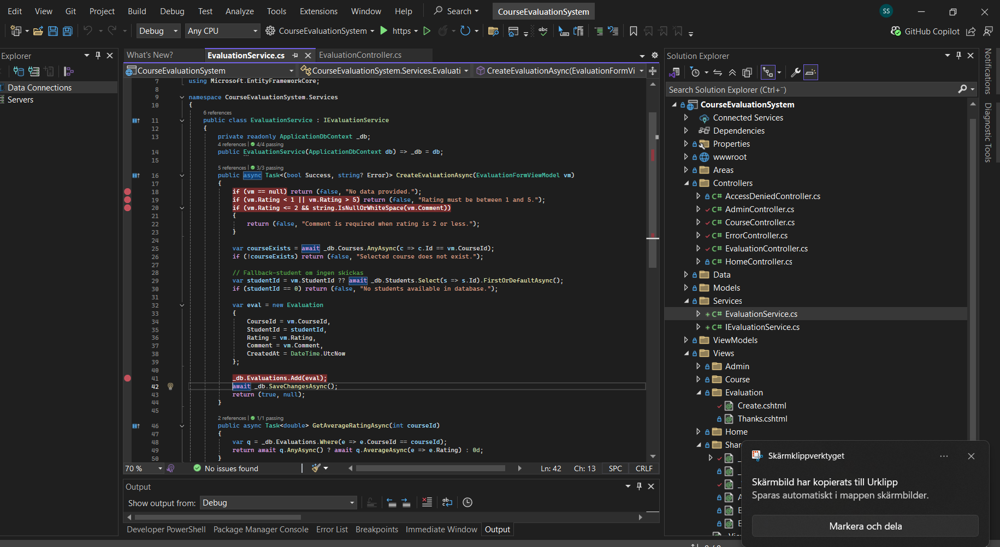
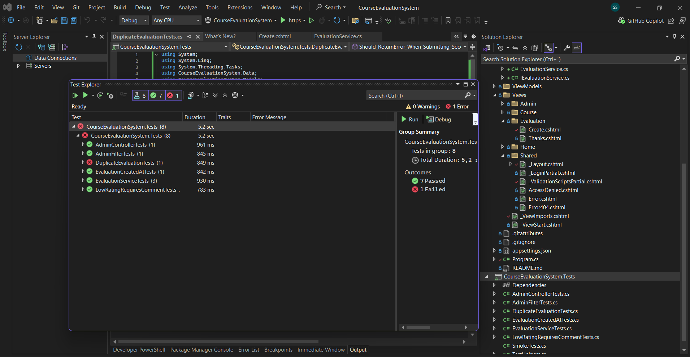
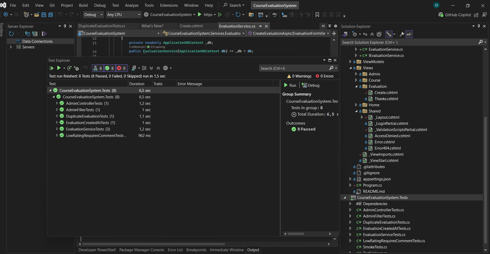

# Course Evaluation System – Debugging & Testing Evidence

This README collects the key screenshots and a short explanation to demonstrate that the solution meets the assessment criteria (5, 6, 7, 14).

## How to run
- Start the app in **Debug**.
- Log in as a student.
- Open a course and submit an evaluation.
- EF Core migrations/seed run on startup.

## Evidence – happy path

- **Controller after service call** – returned `(ok=true, err=null)`.

  
  

- **Thanks page** – redirect after successful submission.

  
  


## Evidence – invalid paths (debugged in Visual Studio)

- **ModelState errors (rating = 0)** captured in the *Immediate* window.

  
  

- **Service rule hit** – rating ≤ 2 with empty comment returns an error and the view shows validation.

  
  


## Evidence – tests

- **All unit tests passed** in Test Explorer.

  
  


## Evidence – TDD (test-first change)

We introduced a small new requirement: **a student can only submit one evaluation per course**.  
To show *Test-Driven Development*, we first added a **failing** test, then implemented the minimal code to make it **pass**.

- Failing test (before implementation):  
  
  

- All tests green after the service change:  
  
  

Commit messages to highlight the process:
- `test: add duplicate-evaluation failing test`
- `feat(service): prevent duplicate evaluation per course/student`

## All screenshots

- 01_controller_ok_err.png: *Controller after service call `(ok=true, err=null)`*

- 02_thanks.png: *Thanks page after successful submission*

- 03_immediate_modelstate.png: *Immediate window showing ModelState errors (rating=0)*

- 04_service_low_rating_rule.png: *Service rule hit (rating <= 2 & empty comment)*

- 05_tests_passed.png: *Test Explorer with all tests passed*

- 06_extra.png: *extra*

- 07_extra.png: *extra*

- 08_extra.png: *extra*

- 09_extra.png: *extra*

- 10_extra.png: *extra*

- 11_extra.png: *extra*

- 12_extra.png: *extra*

- 13_extra.png: *extra*

- 14_extra.png: *extra*

- 15_extra.png: *extra*

- 16_extra.png: *extra*

- 17_extra.png: *extra*

- 18_extra.png: *extra*

- 19_extra.png: *extra*

- 20_extra.png: *extra*

- 21_extra.png: *extra*

- 22_extra.png: *extra*

- 23_extra.png: *extra*

- 24_extra.png: *extra*

- 25_extra.png: *extra*

- 26_extra.png: *extra*

- 27_extra.png: *extra*

- 28_extra.png: *extra*

- 29_extra.png: *extra*

- 30_extra.png: *extra*

- 06_tests_failing1.png: *Failing test (alt filename) – testet rött innan implementation*

- 07_tests_green1.png: *All tests green (alt filename) – alla tester gröna efter ändringen*


## Criteria mapping
- **(14)** Controller calls C# service – verified by stepping into `EvaluationService.CreateEvaluationAsync` and observing the result `(ok, err)`.
- **(6)** Debugging & testing in Visual Studio – breakpoints, Immediate window, and Test Explorer screenshots included.
- **(5)** Followed instructions and technical spec – server-side validation works, invalid inputs rejected.
- **(7)** Git/GitHub with history – ensure multiple meaningful commits when pushing this README and screenshots.


<!-- APPEND: TDD + DEBUG evidence (English) -->

## TDD evidence (RED → GREEN)

Below are two TDD cycles: first a **failing** test (**RED**), then the **minimal** implementation that makes it **pass** (**GREEN**).

### Cycle 1 — Comment max length (1000 chars)
- **RED commit:** failing test  
  Link: <PASTE-LINK-TO-RED-COMMIT-(1000-LIMIT)>
- **GREEN commit:** implementation that makes the test pass  
  Link: <PASTE-LINK-TO-GREEN-COMMIT-(1000-LIMIT)>

*Suggested commit messages:*  
`test(service): failing test for 1000-char comment limit` →  
`feat(service): enforce comment maxlength to satisfy test`

### Cycle 2 — One evaluation per student & course (duplicate rule)
- **RED commit:** failing test  
  Link: <PASTE-LINK-TO-RED-COMMIT-(duplicate)>
- **GREEN commit:** implementation that makes the test pass  
  Link: <PASTE-LINK-TO-GREEN-COMMIT-(duplicate)>

*Suggested commit messages:*  
`test(service): failing test for duplicate evaluation rule` →  
`feat(service): prevent duplicate evaluation per student/course`

> Cycle 1 — Comment max length:
RED:   https://github.com/samir-salloum/CourseEvaluationSystem/commit/893f60107c948ba5c0c07a7b96691e16ddbc9852
GREEN: https://github.com/samir-salloum/CourseEvaluationSystem/commit/f1c09c890d84b161fe115e036ecb6f11ad9d3c3f

Cycle 2 — Duplicate per student/course:
RED:   https://github.com/samir-salloum/CourseEvaluationSystem/commit/20934925245e29fcdc4076909caeed522ad37380
GREEN: https://github.com/samir-salloum/CourseEvaluationSystem/commit/f6924d175b82ba21ea8c9240e289e2cf4ea493d9


---

##  Debugging breakpoints (exact locations)

**`Controllers/EvaluationController.cs`**
- POST `Create(...)`: the line that calls `_evaluationService.CreateEvaluationAsync(model)`.
- The block that sets `model.StudentId` before calling the service.
- After the service returns: where `ModelState` errors are added when `(ok == false)`.

**`Services/EvaluationService.cs`** (inside `CreateEvaluationAsync`)
- Rating bounds (1–5).
- Comment required when `rating ≤ 2`.
- **Max length 1000** check.
- Course fetch/existence check.
- **Duplicate** check:
  `AnyAsync(e => e.CourseId == vm.CourseId && e.StudentId == studentId)`.
- Just before `Add(...)` and `SaveChangesAsync()`.

**`Controllers/AdminController.cs`**
- When the `evals` query is created (`AsQueryable`).
- Course filter (`courseId`).
- Date filters (`fromDate` / `toDate`).
- Aggregation: `GroupBy / Select` right before `ToListAsync()`.


# Course Evaluation System


ASP.NET Core MVC + EF Core. Studenter kan lämna kursutvärderingar (betyg 1–5 + valfri kommentar). Admin ser sammanställningar och kan filtrera per kurs och datum.

## Quick start
1) Skapa DB och kör appen:
   - `dotnet ef database update` (eller bara starta – migrering + seed sker automatiskt).
   - Starta i **Debug**.

2) Logga in
   - **Admin:** `admin@demo.se` / `Admin123!`
   - **Student:** `student@demo.se` / `Student123!`

3) Flöden
   - Student: Kurser → *Details* → *Lämna utvärdering* → *Thanks*.
   - Admin: */Admin* → filtrera per kurs eller datum.

## Tests
- Kör `dotnet test`.
- InMemory-DB, xUnit. Tester täcker: rating-range, kommentar-krav vid ≤2, maxlength 1000, dubblettspärr, CreatedAt, admin-filter m.m.
- (TDD) Se commit-historik: `test: failing ...` → `feat: make test pass`. Skärmbilder finns i `docs/screenshots`.

## Teknik
- EF Core (ORM, LINQ), migrations, seed (demo-data + Identity-roller).
- MVC-pattern, separerat service-lager (`IEvaluationService`).

## Kravmappning (ur kursmålen)
- (5) Tekniska instruktioner/validering följs.
- (6) Debugging/Test Explorer (bilder) + tester.
- (7) Git/GitHub med versionshistorik (se commits).
- (8) Tester före implementation (TDD) – se commit-paret test→feat.
- (11–16) MVC, modeller/relationsdatabas, Razor Views, Controllers→C#-metoder, LINQ/EF.

---

## Features

- Authentication with roles (Student / Admin)
- Students can submit evaluations (rating + comment)
- Admin can view aggregated results per course
- Filtering options for Admin:
  - Filter by course
  - Filter by date range (`CreatedAt`)
- Average rating calculation per course
- Student comments displayed per course
- Unit tests (xUnit + EF Core InMemory)

---

## Getting Started

### 1. Clone the repository
```bash
git [clone https://github.com/yourusername/CourseEvaluationSystem.git](https://github.com/samir-salloum/CourseEvaluationSystem)
cd CourseEvaluationSystem
